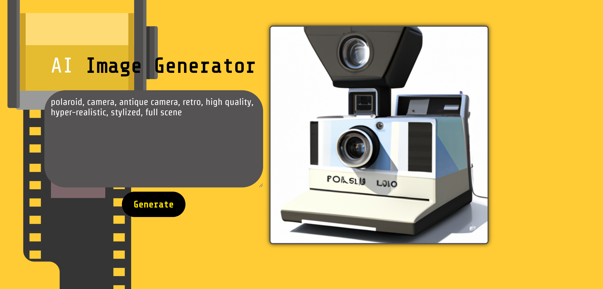
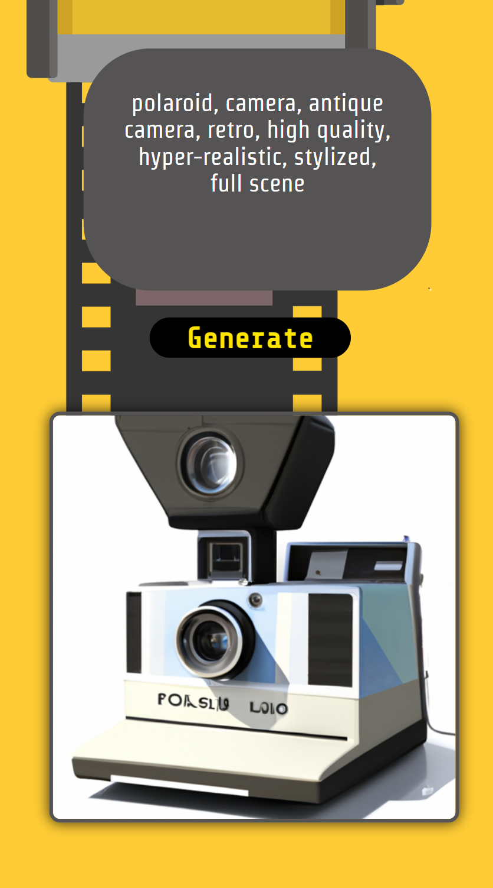
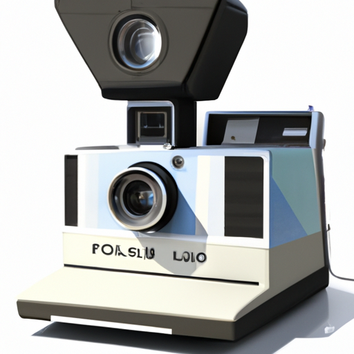

# AI Image Generator

Welcome to the world of AI-powered art! This is a beginner-friendly tool built using OpenAI's API, designed to turn your text descriptions into captivating images. Whether you're a seasoned artist or just starting out, this project lets you explore the creative potential of AI. It represents my first foray into building software with artificial intelligence, and I'm eager to share it with you! Get ready to bring your imagination to life and provide feedback to help shape this project's future.

## Screenshots

Homepage:

Example on Mobile:

The Result:

# Contact

[My Portfolio](https://ryanfann.netlify.app/)

[My GitHub](https://github.com/8BitGinger)
